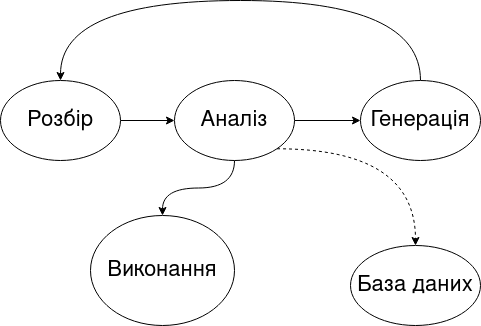

# Обробка природньої мови за допомогою векторів слів Word2Vec

## Зміст
- Вступ
    * Що таке обробка природньої мови(NLP)
    * Практичне застосування
    
- Основні поняття та інструменти NLP
- Сучасні засоби NLP
- Можливості векторів слів Word2Vec/FastText

## Вступ
### Що таке NLP
Обробка природньої мови — це розділ комп'ютерних наук, що займається обробкою людської мови та її перетворенням у числові
дані, на основі яких здійснюються подальші операції пов'язані з мовою,
такі як переклад, генерація нового тексту, аналіз тональності тощо.
Інструменти NLP дозволяють навчити комп'ютер "розуміти" людську мову.
На відміну від мов програмування, природні мови не можуть бути напряму інтерпретовані у
набір чітких інструкцій, зрозумілих комп'ютеру. Але природні мови все одно містять багато
інформації, яку можна структурувати, індексувати та зберігати.

Обробляти мову на основі чітких правил, як це робиться з мовами програмування, не можна,
оскільки будь-яка орфографічна, пунктуаційна або інші помилки порушать роботу такого алгоритму обробки
Також проблемою є те, що природні мови неоднозначні. Однакові слова або словосполучення можуть мати зовсім різний сенс в
залежності від контексту, ситуації, положення в реченні тощо.На приклад, словосполучення "добрий день";людина розуміє,
що це загальноприйняте вітання, а не характеристика часу доби.Зробити так, щоб комп'ютер також розумів це — одна з 
головних задач NLP.

### Сфери практичного застосування 

| Застосування | 1 | 2 | 3
---|---|---|---
**Пошук** | Веб-пошук | пошук по документам | Автодоповнення
**Редагування** | Правопис | Граматика | Стиль
**Діалогові системи** | Чат-бот | Інтелектуальні помічники | Планування
**Електронна пошта** | Спам-фільтри | Класифікація | Пріоритизація
**Аналіз тексту** | Виділення головних ідей | Вилучення сутностей | Медична діагностика 
**Новини** | Створення заголовків | Перевірка фактів | Пошук
**Реферування** | Перевірка на плагіат | Стилізація | Літературна експертиза 
**Аналіз тональності** | Моніторинг настроїв суспільства | Сортування відгуків | -
**Прогнозування** | Фінанси | Вибори | Маркетинг 
**Література** | Написання сценаріїв | Поезія | Слова пісень

Застосування технологій NLP зустрічається в дуже різних сферах, оскільки вони показують зараз високу ефективність і 
беруть на себе багато рутинних задач.


## Основні поняття та підходи NLP

Під час розробки NLP-додатків зручно використовувати концепцію NLP-конвеєру. Такий конвеєр складається з наступних
компонентів:




Розглянемо кожен етап конвеєру:
- Розбір — виділення ознак, тобто структурованих числових даних, із тексту.(Токенізація, стемізація, розпізнавання
  поіменованих сутностей, застосування регулярних виразів)
  
- Аналіз — перевірка граматики, орфографії, аналіз тональності та семантики.

- Генерація — створення можливих відповідей за допомогою засобів пошуку або мовних модлей.
- Виконання — підготовка відповідей на основі попереднього діалогу та його цілей.

Глобально існує два підходи до задач NLP:
* за допомогою шаблонів.Цей підхід полягає в ручному програмуванні і займає багато часу, тому підійде лише для простих
додатків з невеликим корпусом можливих слів.
  
* за допомогою машинного навчання.Цей підхід дозволяє краще описати певні залежності у мові, дозволяє навчити машину
  "розуміти" семантику слів та вирішувати неоднозначності, генерувати відповіді природною мовою.
  Натомість вимагає великої кількості даних(маркованих або ні) та потужного обладнання.
  
## Сучасні засоби NLP

### Засоби токенізації

Частіше за все токенізація є першим етапом конвеєру. Токенізація — це процес розбиття неструктурованого
тексту на окремі елементи. Такими елементами можуть виступати окремі слова, словосполучення, n-грами(об'єднання n слів),
а також інші елементи речення, такі як іменовані сутності, дати тощо.

Прикладом найпростішого токенізатора є функція, яка розбиває речення на слова по пробілах.
```python
example_sent = "Назву «машинне навчання» було започатковано 1959 року Артуром Семюелем."
example_sent.split()
```

```
out:
['Назву',
 '«машинне',
 'навчання»',
 'було',
 'започатковано',
 '1959',
 'року',
 'Артуром',
 'Семюелем.']
```
Такий токенізатор має багато недоліків.Наприклад токен "«машинне" зберігся разом з лапками, тому буде відрізнятися від
токену "машинне", що призведе до небажаних результатів. Більш точні токенізатори реалізуються за допомогою регулярних
виразів та певних мовних правил. Приклад такого токенізатору можна знайти в модулі nltk для Python.

```python
from nltk.tokenize import TreebankWordTokenizer
tokenizer = TreebankWordTokenizer()
example_sent = "Назву «машинне навчання» було започатковано 1959 року Артуром Семюелем."
tokenizer.tokenize(example_sent)
```
```
out:
['Назву',
 '«',
 'машинне',
 'навчання',
 '»',
 'було',
 'започатковано',
 '1959',
 'року',
 'Артуром',
 'Семюелем',
 '.']
```

За допомогою такого токенізатора можна побудувати просту модель векторного простору слів.

```python
sentences = "Машинне навчання — це підгалузь штучного інтелекту в галузі інформатики, яка часто застосовує статистичні прийоми для надання комп'ютерам здатності «навчатися» (тобто, поступово покращувати продуктивність у певній задачі) з даних, без того, щоби бути програмованими явно.\n"
sentences += "Назву «машинне навчання» було започатковано 1959 року Артуром Семюелем.\n"
sentences += "Машинне навчання тісно пов'язане (та часто перетинається) з обчислювальною статистикою, яка також зосереджується на прогнозуванні шляхом застосування комп'ютерів.\n"
sentences += "Воно має тісні зв'язки з математичною оптимізацією, яка забезпечує цю галузь методами, теорією та прикладними областями."

corpus = {}
for i, sent in enumerate(sentences.split('\n')):
  corpus[f'Речення №{i}'] = dict((tok, 1) for tok in tokenizer.tokenize(sent))

df = pd.DataFrame.from_records(corpus).fillna(0).astype(int).T
```
Out:

|            |   Машинне |   навчання |   — |   це |   підгалузь |   штучного |   інтелекту |   в |   галузі |   інформатики |   , |   яка |   часто |   застосовує |   статистичні |   прийоми |   для |   надання |   комп'ютерам |   здатності |   « |   навчатися |   » |   ( |   тобто |   поступово |   покращувати |   продуктивність |   у |   певній |   задачі |   ) |   з |   даних |   без |   того |   щоби |   бути |   програмованими |   явно |   . |   Назву |   машинне |   було |   започатковано |   1959 |   року |   Артуром |   Семюелем |   тісно |   пов'язане |   та |   перетинається |   обчислювальною |   статистикою |   також |   зосереджується |   на |   прогнозуванні |   шляхом |   застосування |   комп'ютерів |   Воно |   має |   тісні |   зв'язки |   математичною |   оптимізацією |   забезпечує |   цю |   галузь |   методами |   теорією |   прикладними |   областями |
|:-----------|----------:|-----------:|----:|-----:|------------:|-----------:|------------:|----:|---------:|--------------:|----:|------:|--------:|-------------:|--------------:|----------:|------:|----------:|--------------:|------------:|----:|------------:|----:|----:|--------:|------------:|--------------:|-----------------:|----:|---------:|---------:|----:|----:|--------:|------:|-------:|-------:|-------:|-----------------:|-------:|----:|--------:|----------:|-------:|----------------:|-------:|-------:|----------:|-----------:|--------:|------------:|-----:|----------------:|-----------------:|--------------:|--------:|-----------------:|-----:|----------------:|---------:|---------------:|--------------:|-------:|------:|--------:|----------:|---------------:|---------------:|-------------:|-----:|---------:|-----------:|----------:|--------------:|------------:|
| Речення №0 |         1 |          1 |   1 |    1 |           1 |          1 |           1 |   1 |        1 |             1 |   1 |     1 |       1 |            1 |             1 |         1 |     1 |         1 |             1 |           1 |   1 |           1 |   1 |   1 |       1 |           1 |             1 |                1 |   1 |        1 |        1 |   1 |   1 |       1 |     1 |      1 |      1 |      1 |                1 |      1 |   1 |       0 |         0 |      0 |               0 |      0 |      0 |         0 |          0 |       0 |           0 |    0 |               0 |                0 |             0 |       0 |                0 |    0 |               0 |        0 |              0 |             0 |      0 |     0 |       0 |         0 |              0 |              0 |            0 |    0 |        0 |          0 |         0 |             0 |           0 |
| Речення №1 |         0 |          1 |   0 |    0 |           0 |          0 |           0 |   0 |        0 |             0 |   0 |     0 |       0 |            0 |             0 |         0 |     0 |         0 |             0 |           0 |   1 |           0 |   1 |   0 |       0 |           0 |             0 |                0 |   0 |        0 |        0 |   0 |   0 |       0 |     0 |      0 |      0 |      0 |                0 |      0 |   1 |       1 |         1 |      1 |               1 |      1 |      1 |         1 |          1 |       0 |           0 |    0 |               0 |                0 |             0 |       0 |                0 |    0 |               0 |        0 |              0 |             0 |      0 |     0 |       0 |         0 |              0 |              0 |            0 |    0 |        0 |          0 |         0 |             0 |           0 |
| Речення №2 |         1 |          1 |   0 |    0 |           0 |          0 |           0 |   0 |        0 |             0 |   1 |     1 |       1 |            0 |             0 |         0 |     0 |         0 |             0 |           0 |   0 |           0 |   0 |   1 |       0 |           0 |             0 |                0 |   0 |        0 |        0 |   1 |   1 |       0 |     0 |      0 |      0 |      0 |                0 |      0 |   1 |       0 |         0 |      0 |               0 |      0 |      0 |         0 |          0 |       1 |           1 |    1 |               1 |                1 |             1 |       1 |                1 |    1 |               1 |        1 |              1 |             1 |      0 |     0 |       0 |         0 |              0 |              0 |            0 |    0 |        0 |          0 |         0 |             0 |           0 |
| Речення №3 |         0 |          0 |   0 |    0 |           0 |          0 |           0 |   0 |        0 |             0 |   1 |     1 |       0 |            0 |             0 |         0 |     0 |         0 |             0 |           0 |   0 |           0 |   0 |   0 |       0 |           0 |             0 |                0 |   0 |        0 |        0 |   0 |   1 |       0 |     0 |      0 |      0 |      0 |                0 |      0 |   1 |       0 |         0 |      0 |               0 |      0 |      0 |         0 |          0 |       0 |           0 |    1 |               0 |                0 |             0 |       0 |                0 |    0 |               0 |        0 |              0 |             0 |      1 |     1 |       1 |         1 |              1 |              1 |            1 |    1 |        1 |          1 |         1 |             1 |           1 |

За допомогою двох таких векторів можна виміряти схожість двох речень використавши операцію скалярного добутку
```python
df.sent0.dot(df.sent2)
```
```
out:
9
```

### Стоп-слова
В процесі токенізації часто з'являються токени, які входять до складу великої 
кількості речень і не мають якогось особливого сенсу. Такі слова називаються
стоп-словами.Словник стоп-слів як правило невеликий, і його можна створити власноруч.
Приклад словника стоп-слів для російської можна побачити в модулі nltk.
```python
stop_words = nltk.corpus.stopwords.words('russian')
len(stop_words)
stop_words
```
```
out:
151
['и',
 'в',
 'во',
 'не',
 'что',
 'он',
 'на',
 'я',
 'с',
 'со',
 'как',
 'а',
 'то',
 'все',
 'она',
 'так',
 'его',
 'но',
 'да',
 'ты',
 'к',
 'у',
 'же',
 'вы',
 ...
 ]
```
Як можна побачити, розмір цього словника невеликий - 151 слово. Він містить в собі слова тих частин
мови, які не мають особливого змісту для алгоритмів NLP.

### Нормалізація словника

Після етапу токенізації часто застосовують різні методи нормалізації словника, що дозволяє зменшити 
його розмірність.
До методів нормалізації належать:
* Вирівнювання регістру
* Стемінг
* Лематизація

#### Вирівнювання регістру
Цей метод може значно зменшити розмір словника(до 2 разів), але часто він несе за собою значні втрати 
інформації.На приклад, для задач розпізнавання іменованих сутностей цей метод не підійде, але для задач пошуку
його використовують майже завжди(Google, Bing)

#### Стемінг
Суть цього методу полягає в зведенні схожих слів до однієї основи.На приклад, зведення різних відмінкових
форм до називного відмінку, або зведення дієслів до інфінітиву. Стемою може також бути не слово, а лише 
його частина, на приклад, корінь слова.

#### Лематизація 
Найбільш точний спосіб нормалізації, оскільки враховується також значення слова.На приклад, слово "краще"
може бути лематизовано до "добре".

